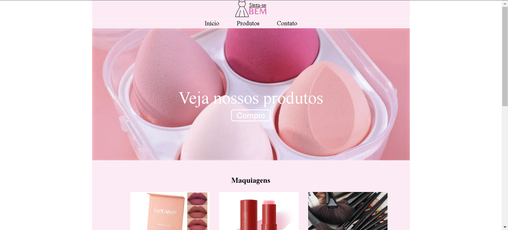

<h1 align="center"> Project copy Web Page </h1>

This is a project carried out having a real page as inspiration for the creation of a page for fixing WEB knowledge  

  <a href="#-tecnologias">Technologies</a>&nbsp;&nbsp;&nbsp;|&nbsp;&nbsp;&nbsp;
  <a href="#-projeto">Project</a>&nbsp;&nbsp;&nbsp;

 

  

## 🚀 Technologies

This project was developed with the following technologies:

- HTML and CSS
- Git and Github

## 💻 Project

This project is a page redesign webpage used for sales. It has an interactive navigation bar, banner with floating button, product catalog and footer with contact and social networks.

Interactive navigation buttons. interactive catalog images. social media icons with hover

- [Access the finished project online](https://github.com/Carlos-EduardoAlmeida/ProjectWebPage)

---

Made by Carlos Eduardo De Almeida Silva